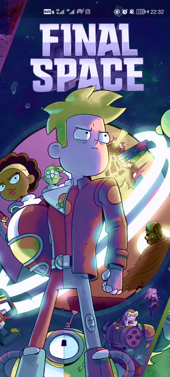
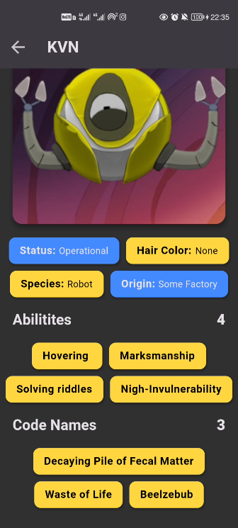
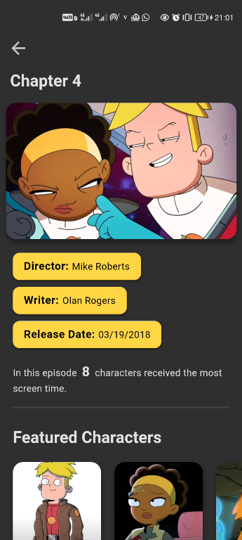
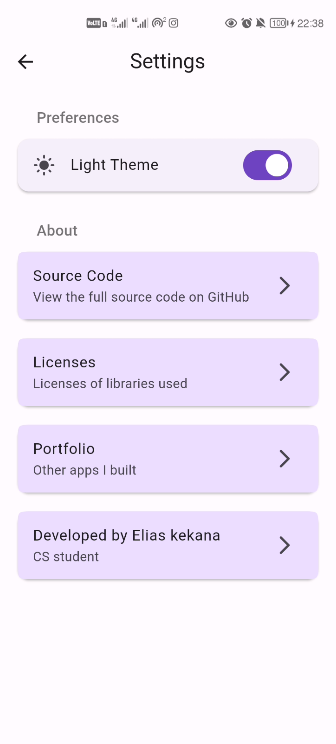
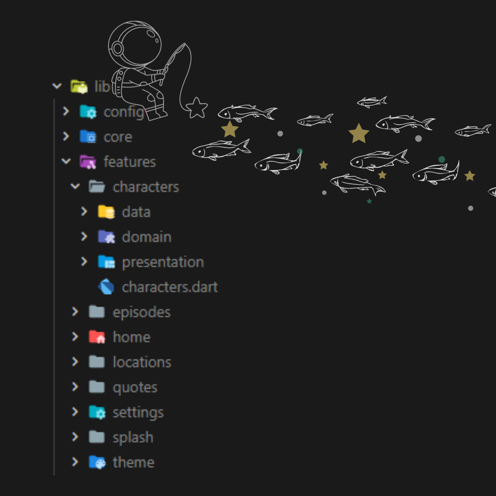

# Interstellar Insight 👽

Interstellar Insight is a mobile application dedicated to fans of the popular TV series "Final Space." This app offers an immersive experience for fans, providing them with valuable information about the show's characters, episodes, and locations. Dive into the Final Space universe and explore various aspects of the series with ease. It was built with Flutter using Clean Architecture principles.

</a>

- [Interstellar Insight 👽](#interstellar-insight-)
  - [Features](#features)
  - [Screenshots](#screenshots)
    - [Splash](#splash)
    - [Characters](#characters)
    - [Episodes](#episodes)
    - [Locations](#locations)
    - [Quotes](#quotes)
    - [Settings](#settings)
    - [Project Structure](#project-structure)
  - [Getting Started](#getting-started)
    - [Prerequisites](#prerequisites)
    - [Installing](#installing)
  - [Folder Structure](#folder-structure)
  - [State Management](#state-management)
  - [Data Source](#data-source)
  - [Themes](#themes)
  - [Contributing](#contributing)
  - [Getting Started with Flutter](#getting-started-with-flutter)

## Features

- Browse and explore characters from Final Space.
- View character details, including their status, species, abilities, and more.
- Discover episodes of the series.
- Explore memorable locations featured in the show.
- Beautiful animations.
- Dark and Light Theme

## Screenshots

### Splash

</a>

### Characters

<p float="left">
</a>
</a>
</p>

<p float="left">
</a>
</a>
</p>

<p float="left">
</a>
</a>
</p>

<p float="left">
</a>
</a>
</p>

### Episodes

<p float="left">
</a>
</a>
</p>

<p float="left">
</a>
</a>
</p>

### Locations

<p float="left">
</a>
</a>
</p>

<p float="left">
</a>
</a>
</p>

### Quotes

<p float="left">
</a>
</a>
</p>

### Settings

<p float="left">
</a>
</a>
</p>

### Project Structure

</a>

## Getting Started

Follow these instructions to get the app up and running on your local machine.

### Prerequisites

Before running the app, make sure you have Flutter installed on your system. If you haven't installed Flutter yet, follow the official Flutter installation guide: [Flutter Installation](https://flutter.dev/docs/get-started/install)

### Installing

1. Clone this repository to your local machine using Git:

```
git clone https://github.com/eliascreates/interstellar_insight.git
```

2. Change to the project directory:

```
cd interstellar_insight
```

3. Install the required dependencies:

```
flutter pub get
```

4. Run the app:

```
flutter run
```

## Folder Structure

The Interstellar Insight app follows a Clean Architecture structure to separate concerns, making the codebase maintainable and scalable.

- `lib/` contains the application code.
  - `feature/` houses the different features within the app.
    - `characters/` includes the Interstellar characters feature, containing all characters.
      - `data/` contains the data layer with repository and data source implementations.
      - `domain/` holds the domain layer with entities, use cases, and repository interfaces.
      - `presentation/` encompasses the presentation layer, including the user interface (UI), Business Logic Components (BLoCs), and other UI-related components.
    - `episodes/` showcases the Interstellar episodes feature.
    - `locations/` introduces the Interstellar locations feature, complete with all locations and notable resident characters.

## State Management

The Interstellar Insight app employs the BLoC (Business Logic Component) pattern for state management. This pattern allows for a clear separation of UI and business logic, offering an organized approach to manage the app's state.

## Data Source

The app fetches data from the "Final Space" API as the remote data source for JSON GET requests. The "Final Space" API provides data related to an animated TV series.

## Themes

Interstellar Insight offers both light and dark themes, allowing users to personalize their app experience. You can switch between themes through the app's settings.

## Contributing

To contribute to the project, follow these steps:

1. Fork the project on GitHub.
2. Create a feature branch for implementing your changes.
3. Submit a pull request, providing a detailed description of your changes and their purpose.
4. Engage in the code review process to further enhance the project.

---

## Getting Started with Flutter

This project is a starting point for a Flutter application.

A few resources to get you started if this is your first Flutter project:

- [Lab: Write your first Flutter app](https://docs.flutter.dev/get-started/codelab)
- [Cookbook: Useful Flutter samples](https://docs.flutter.dev/cookbook)

For help getting started with Flutter development, view the
[online documentation](https://docs.flutter.dev/), which offers tutorials,
samples, guidance on mobile development, and a full API reference.
